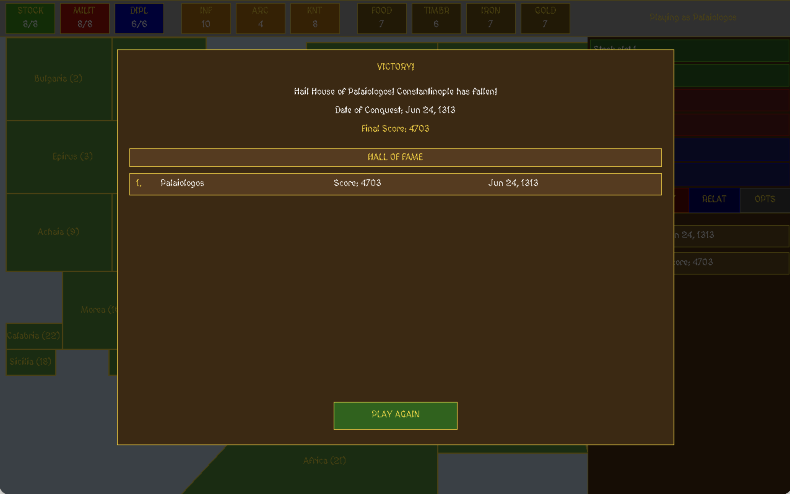

# Castles III: Siege & Conquest

A medieval strategy game of conquest, resource management, and diplomacy set in the late Eastern Roman world.

## Build Instructions
```bash
make run
```

## Features
- Turn-based date system with resource collection
- Province conquest with animated combat progress
- Dynasty selection with unique starting territories
- Score-based unlock system
- Background music with toggle

## Roadmap
- [ ] Updates to rectangular province UI (difficult)
- [ ] Advanced combat system
- [ ] Add diplomacy (bribe province, relationships to prevent attack on owned provinces)
- [ ] Save/Load
- [ ] Construct Castles (difficult)
- [ ] Special Quests
- [ ] Upkeep like paying and feeding troops
- [ ] Spying
- [ ] Easy, Medium and Hard mode
- [ ] Randomized Resources

